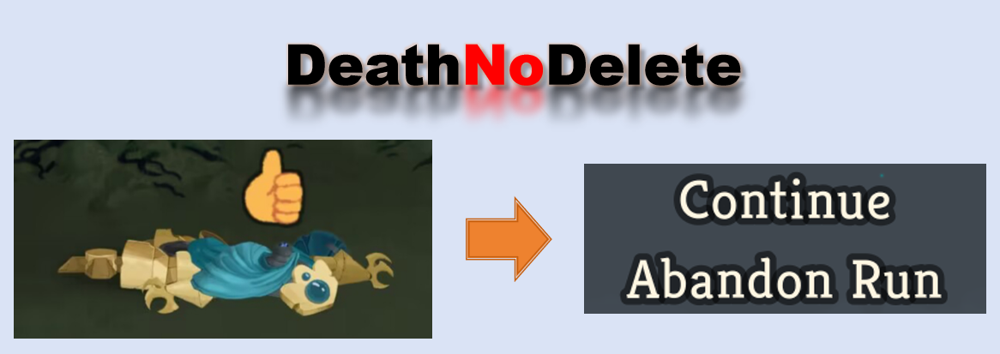

# Death No Delete

[**简体中文**](README_ZH.md) | [**Changelog**](ChangeLog.md)

*A DeathNoDelete mod for Slay the Spire 2.*

Have you ever been **instantly wiped out** because you miscalculated simple kindergarten-level addition/subtraction or elementary school multiplication/division?

Or maybe you **missed** checking your hand cards or buffs and ended up **dying suddenly**?

No worries! This mod is here to help you!

## ✨ Core Features

After loading this mod, <u>**unless you win or give up**</u>, your save file **will not be deleted**.

Say goodbye to unlucky runs ending in sudden death!

> In multiplayer mode, the **host must load** the mod for it to take effect. Similarly, other players besides the host do not need to load it.

## 🎮 Installation

1. Download the latest **zip** from the **Releases** page.
2. Extract the archive and copy the inner `DeathNoDelete` folder to your game directory: `<Slay the Spire 2>/mods/`.
3. Launch the game and enable the mod in the **Mods** menu.

## ⚙️ Build

If you want to build the project yourself:
- Set `Sts2Dir` in `DeathNoDelete.csproj` to the path of your game installation.
- Or build using: `dotnet build -p:Sts2Dir="Your Slay the Spire 2 Path"`
